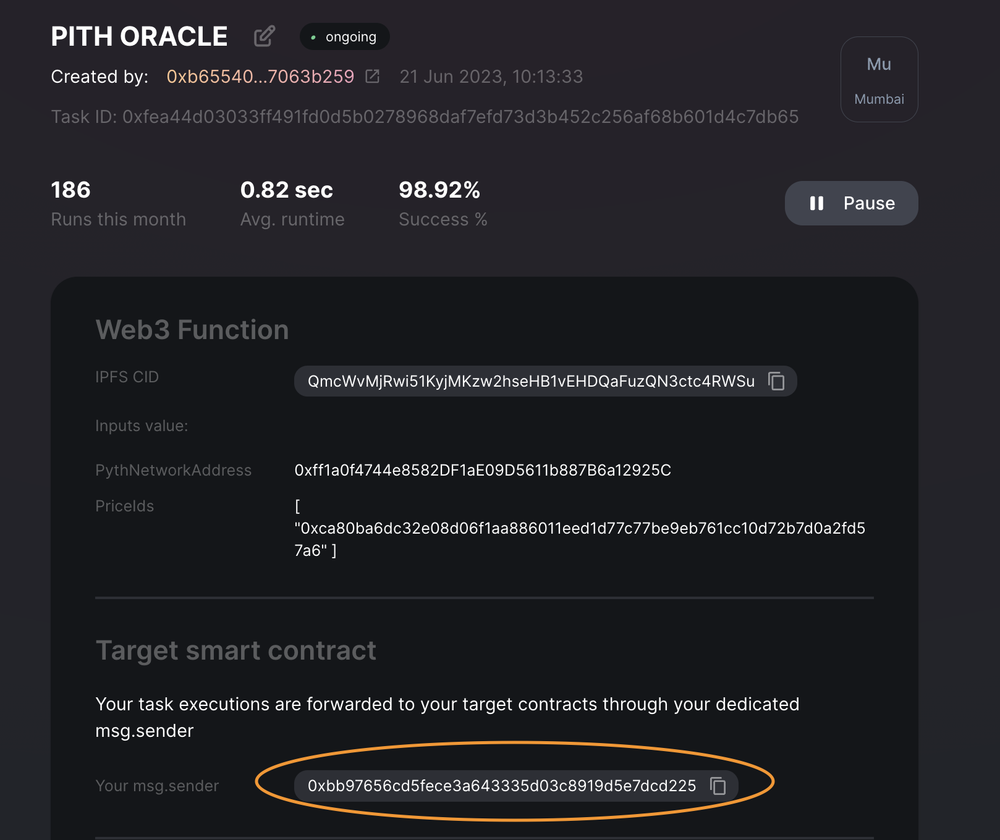

# Gelato Web3 functions <<-->> Pyth PoC
Gelato Web3 Functions together with Pyth offer the ability to create fine-tuned customized oracles pushing prices on-chain following predefined logic within the Web3 Function and verifying prices on-chain through the Pyth network.

In this repo we have two demos:
1) [W3F to Pyth](https://github.com/gelatodigital/w3f-pyth-poc-v2/tree/master/web3-functions/pyth-oracle-w3f) that directly interact with the Pyth network. 

2) [W3F to Consumer Contract](https://github.com/gelatodigital/w3f-pyth-poc-v2/tree/master/web3-functions/pyth-oracle-consumer-contract) and a second one using a consumer contract.

   In both cases the logic is the same, the prices are going to be updated following:

   - Push a price on-chain every hour
   - If since the last push, the price change is greater or equal to 2% in either direction, a new price will be pushed

## Funding
We will fund Gelato and Pyth following this process:
1) Gelato:
  The gelato fees are payed with [1Balance](https://docs.gelato.network/developer-services/1balance). 
  1Balance allows to deposit USDC on polygon and run the transactions on every network.

   To fund 1Balance please visit the [1balance app](https://beta.app.gelato.network/balance) and deposit USDC.
   (The 1Balance account has to be created with the same address as the Web3 Function task)
  
  - Switch network to Polygon

      

  - Deposit USDC

      

2) Pyth:
The method that updates the price is payable, the update transaction has to include in the msg.value the corresponding fee:

```ts
    /// @notice Update price feeds with given update messages.
    /// This method requires the caller to pay a fee in wei; the required fee can be computed by calling
    /// `getUpdateFee` with the length of the `updateData` array.
    /// Prices will be updated if they are more recent than the current stored prices.
    /// The call will succeed even if the update is not the most recent.
    /// @dev Reverts if the transferred fee is not sufficient or the updateData is invalid.
    /// @param updateData Array of price update data.
    function updatePriceFeeds(bytes[] calldata updateData) external payable;
```
In our two demos we will transfer the fee differently:
  - W3F update pyth network  
    The on-chain transaction executed via a web3 function gets routed through a proxy smart contract which is solely owned by the web3 function task creator. This [dedicatedMsgSender](https://mumbai.polygonscan.com/address/0xbb97656cd5fece3a643335d03c8919d5e7dcd225) proxy contract will be deployed with the first task created and will ultimately be responsible for transferring the fee to the Pyth contract.

    The address can be seen in your task dashboard (i.e [example task dashboard](https://beta.app.gelato.network/task/0xfea44d03033ff491fd0d5b0278968daf7efd73d3b452c256af68b601d4c7db65?chainId=80001)) 

     
    
    Once we have the [dedicatedMsgSender](https://mumbai.polygonscan.com/address/0xbb97656cd5fece3a643335d03c8919d5e7dcd225) address we will have to fund it for paying the fees. 
    In our example we have sent funds to the dedicated MsgSender with this [transaction](https://mumbai.polygonscan.com/tx/0x76820435112844d166f684bc46d0861cca22840e8ae1370d90e9d4984a13c037)

    Once the dedicatedMsgSender is funded, the Web3 Function will execute passing the fee as value in the callData:

    ```ts
    return {
      canExec: true,
      callData: [
        {
          to: pythNetworkAddress,
          data: callData,
          value: fee,
        },
      ],
    };
    ```

  - W3F Consumer Contract:
    The contract has to be funded with native tokens and then simply query the fee and include it in the transaction value.

    ```sol  
        uint256 fee = _pyth.getUpdateFee(updatePriceData);
        _pyth.updatePriceFeeds{value: fee}(updatePriceData);
    ```


## Demo W3F update directly Pyth Contract
Live on Mumbai
- Web3 Function: [https://beta.app.gelato.network/task/0xfea44d03033ff491fd0d5b0278968daf7efd73d3b452c256af68b601d4c7db65?chainId=80001](https://beta.app.gelato.network/task/0xfea44d03033ff491fd0d5b0278968daf7efd73d3b452c256af68b601d4c7db65?chainId=80001)

- DedicatedMsgSender [https://mumbai.polygonscan.com/address/0xbb97656cd5fece3a643335d03c8919d5e7dcd225](https://mumbai.polygonscan.com/address/0xbb97656cd5fece3a643335d03c8919d5e7dcd225)


## Demo W3F update Pyth consumer contract

Live on Mumbai

- Smart Contract: [https://mumbai.polygonscan.com/address/0x4c1b1ae4b671d7a778dcddcdc62a14940ec438ba](https://mumbai.polygonscan.com/address/0x4c1b1ae4b671d7a778dcddcdc62a14940ec438ba)
- Web3 Function: [https://beta.app.gelato.network/task/0x98a2402baabf9bd94d27a804a68ca2ac61a907b518a5c3168d9c94f808bcfb2d?chainId=80001](https://beta.app.gelato.network/task/0x98a2402baabf9bd94d27a804a68ca2ac61a907b518a5c3168d9c94f808bcfb2d?chainId=80001)

## Development

### How to run

1. Install project dependencies:
```
yarn install
```

2. Create a `.env` file with your private config:
```
cp .env.example .env
```
You will need to input your `PROVIDER_URL`, your RPC.


3. Test the  web3 function

W3F Pyth
```
npx w3f test web3-functions/pyth-oracle-w3f/index.ts --logs
```
W3F Consumer Contract

```
npx w3f test web3-functions/pyth-oracle-consumer-contract/index.ts --logs
```

4. Deploy the web3 function on IPFS

W3F Pyth
```
npx w3f deploy web3-functions/pyth-oracle-w3f/index.ts
```
W3F Consumer Contract
```
npx w3f deploy web3-functions/pyth-oracle-consumer-contract/index.ts
```

5. Create the task following the link provided when deploying the web3 to IPFS in our case:

W3F Pyth

```
 ✓ Web3Function deployed to ipfs.
 ✓ CID: QmSpBYETcncrJKbXGPjtdxn5L6i12joJ6kvWrCsNMP3XFD

To create a task that runs your Web3 Function every minute, visit:
> https://beta.app.gelato.network/new-task?cid=QmSpBYETcncrJKbXGPjtdxn5L6i12joJ6kvWrCsNMP3XFD
```

W3F Consumer Contract

```
 ✓ Web3Function deployed to ipfs.
 ✓ CID: QmdrJyVznzHBrzb3zjwxPWU35rCRQmiPTk1LFejeqHHeMt

To create a task that runs your Web3 Function every minute, visit:
> https://beta.app.gelato.network/new-task?cid=QmdrJyVznzHBrzb3zjwxPWU35rCRQmiPTk1LFejeqHHeMt
```


You can find a template/instructions for W3F Pyth with dynamic configuration values loaded from a Github gist that allows you to update priceIds and various parameters without having to re-deploy the task in `web3-functions/pyth-oracle-w3f-priceIds`.