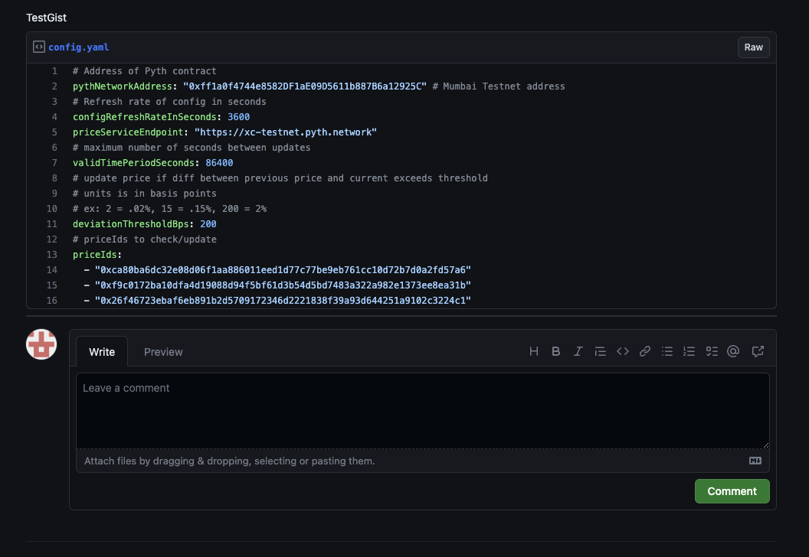

# Gelato Web3 Pyth Functions with Dynamic Configuration

This directory contains a template for running a web3 function that's an optimized version of [W3F to Pyth](https://github.com/gelatodigital/w3f-pyth-poc-v2/tree/master/web3-functions/pyth-oracle-w3f) where the staleness, price deviation and priceIds are dynamically configurable/loaded from a Github Gist and `updatePriceFeedsIfNecessary` is called instead of `updatePriceFeeds`.

## Funding

There are two sets of fees that must be paid:

1. Gelato Fees:
   The gelato fees are payed with [1Balance](https://docs.gelato.network/developer-services/1balance).
   1Balance allows to deposit USDC on polygon and run the transactions on every network.

   To fund 1Balance please visit the [1balance app](https://beta.app.gelato.network/balance) and deposit USDC.
   (The 1Balance account has to be created with the same wallet/address that will create the Web3 Function task)

   - Switch network to Polygon

      

   - Deposit USDC
  
      


   **On testnets, the Gelato fees are fully subsidized by Gelato**

2. Pyth Fees:
   The method that updates the price is payable, the update transaction has to include in the msg.value the corresponding fee:

   ```ts
       /// @notice Update price feeds with given update messages if any of the price feeds need to be updated
       /// This method requires the caller to pay a fee in wei; the required fee can be computed by calling
       /// `getUpdateFee` with the length of the `updateData` array.
       /// Prices will be updated if they are more recent than the current stored prices.
       /// The call will succeed even if the update is not the most recent.
       /// @dev Reverts if the transferred fee is not sufficient or the updateData is invalid.
       /// @param updateData Array of price update data.
       function updatePriceFeedsIfNecessary(
           bytes[] calldata updateData,
           bytes32[] calldata priceIds,
           uint64[] calldata publishTimes
       ) external payable;
   ```

   - W3F Pyth Dynamic Configuration
     The on-chain transaction executed via a web3 function gets routed through a proxy smart contract which is solely owned by the web3 function task creator (aka the `dedicatedMsgSender`). This `dedicatedMsgSender` proxy contract will be deployed with the first task created by your wallet and will ultimately be responsible for transferring the fee to the Pyth contract.
     - Fund the `dedicatedMsgSender` with native tokens using a standard transfer [example funding transaction](https://mumbai.polygonscan.com/tx/0x76820435112844d166f684bc46d0861cca22840e8ae1370d90e9d4984a13c037)

**Note that after you create first task, you must ensure the `dedicatedMsgSender` is funded otherwise the task will fail to execute**

## Development

### How to run

1. Install project dependencies:

```
yarn install
```

2. Create a `.env` file with your private config:

```
cp .env.example .env
```

You will need to input your `PROVIDER_URL`, your RPC.

1. For testing up W3F Pyth Dynamic PriceIds you will also need to do the following:

   1. create a github gist and create a file named `config.yaml`. You can use either the `config-mumbai.yaml` or `config-polygon.yaml` in `pyth-oracle-w3f-priceIds` as an example.

   
   2. create a `.env` in the local w3f directory
   
   ```
   cp web3-functions/pyth-oracle-w3f-priceIds/.env.example web3-functions/pyth-oracle-w3f-priceIds/.env
   ```
   3. set the `GIST_ID` in `web3-functions/pyth-oracle-w3f-priceIds/.env` in the `pyth-oracle-w3f-priceIds` directory

2. Test the web3 function

W3F Pyth Dynamic PriceIds

```
# run the web3 function locally
npx hardhat w3f-run pyth-oracle-w3f-priceIds --logs --debug
```

# Deployment

1. Deploy the web3 function on IPFS

W3F Pyth PriceIds

```
npx hardhat w3f-deploy pyth-oracle-w3f-priceIds
```

2. Create the task following the link provided when deploying the web3 to IPFS in our case: (if you make any changes to the web3function you will have to re-upload it and create a new task using the newly generated link since the CID will change)

W3F Pyth PriceIds

```
 ✓ Web3Function deployed to ipfs.
 ✓ CID: QmWUvLsbk84tGsg6tpqaF5nwkmbn5gAMcVxukQEgT646eZ

To create a task that runs your Web3 Function every minute, visit:
> https://beta.app.gelato.network/new-task?cid=QmWUvLsbk84tGsg6tpqaF5nwkmbn5gAMcVxukQEgT646eZ
```

3. When creating the task using the link, you will need to set `GIST_ID` in secrets with the gistId that will be used for reading
   
